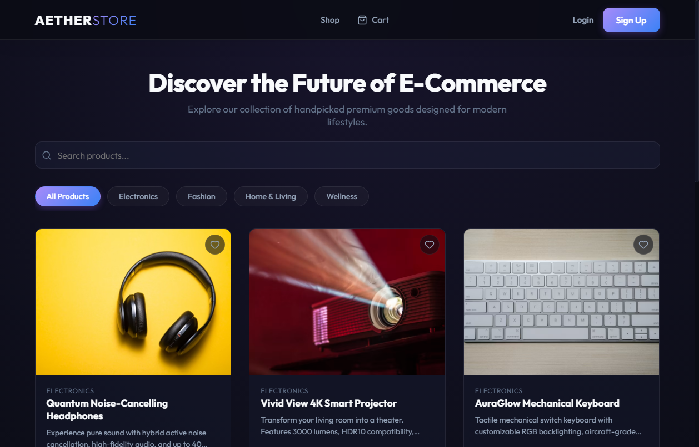
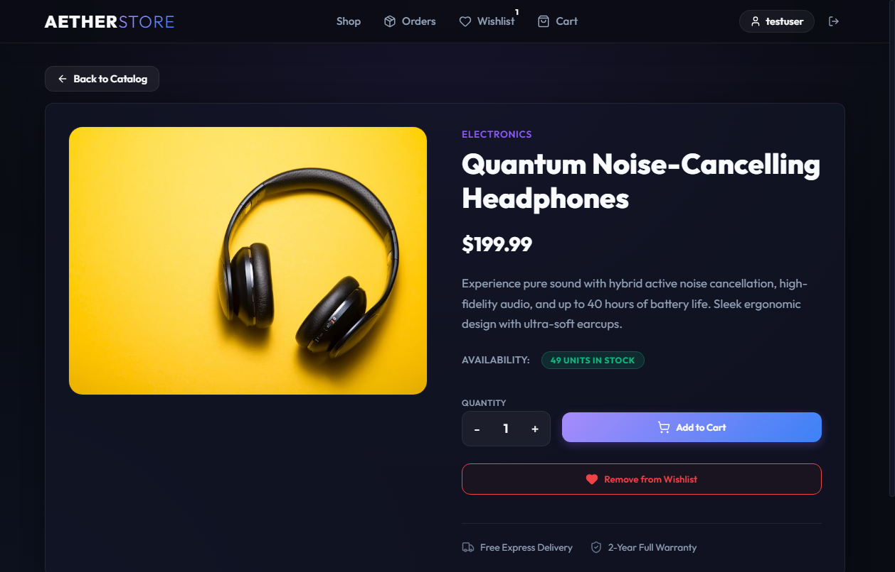
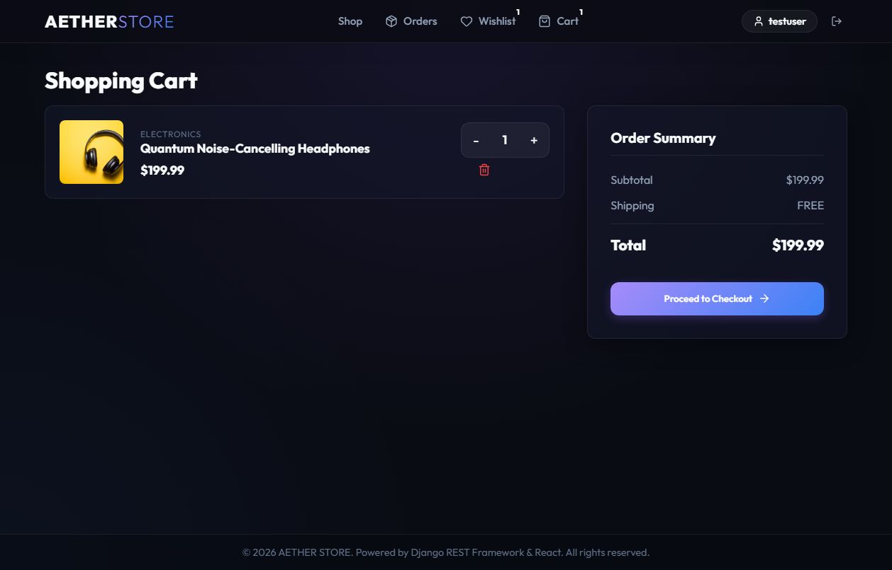
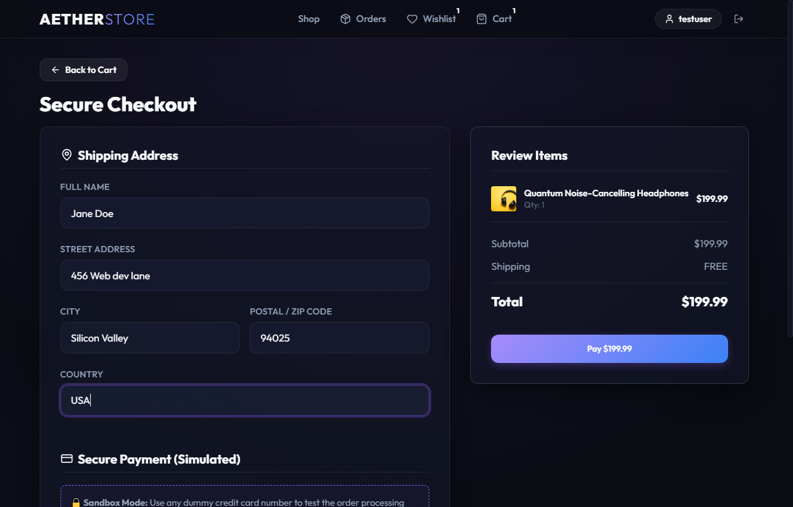
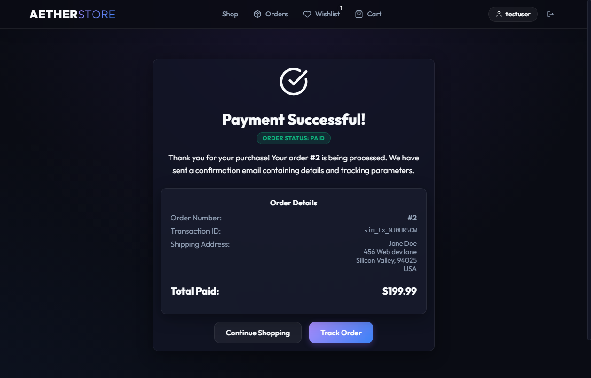
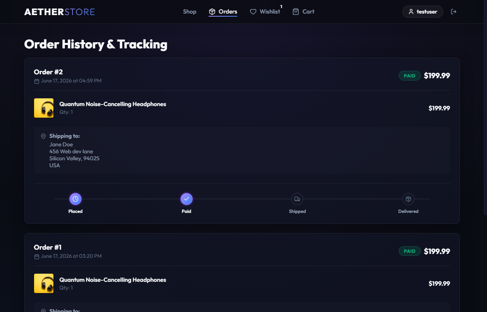

# Aether Store - Full-Stack E-Commerce Web Application

Aether Store is a full-stack e-commerce web application featuring a premium glassmorphic dark-mode interface. Built using **React (Vite)** on the frontend and **Django REST Framework** on the backend, the platform supports JWT authentication, catalog search and filters, a synchronized shopping cart and wishlist, simulated checkout payments, and live order tracking.

---

## 🌟 Key Features

### 🛍️ Product Catalog & Discovery
*   **Seeded Catalog**: Premium goods complete with high-resolution imagery and descriptions.
*   **Search & Filters**: Real-time keyword search and tabbed filtering by categories.
*   **Detailed View**: Stock level status, specs, and quantities control.

### 🔐 User Accounts & Security
*   **JWT Authentication**: Secure login and registration flows powered by `djangorestframework-simplejwt`.
*   **Automatic Refresh**: Seamless background access token renewals every 15 minutes.
*   **Persistent Sessions**: Local storage synchronization to preserve shopping sessions.

### 🛒 Cart & Wishlist Syncing
*   **Wishlist**: Save favorite items for later with one-click toggles.
*   **Shopping Cart**: Incremental quantity controls, live price aggregation, and free-shipping margin indicators.

### 📦 Order Management & Checkout
*   **Simulated Checkout**: Fill in shipping details and submit simulated credit card details.
*   **Stock Verification**: Checks inventory levels in real-time, deducting quantity upon successful payment.
*   **Visual Tracking**: Timeline indicating order status (*Placed* $\rightarrow$ *Paid* $\rightarrow$ *Shipped* $\rightarrow$ *Delivered*).

---

## 🎨 Screenshot Showcase

### 🏠 Shop Homepage


### 📄 Product Details


### 🛒 Shopping Cart


### 💳 Simulated Checkout


### 🎉 Order Successful Checkout


### 🚚 Order Tracking Timeline


---

## 🛠️ Technology Stack

### Frontend
*   **React (Vite)** (v18+)
*   **React Router DOM** (Client-side page navigation)
*   **Vanilla CSS** (Custom variables, transitions, and glassmorphic aesthetics)
*   **Lucide React** (Vector icons)

### Backend
*   **Django** (v6+)
*   **Django REST Framework** (REST APIs)
*   **Simple JWT** (JSON Web Token auth)
*   **Django CORS Headers**

### Database
*   **SQLite** (Local fallback development)
*   **PostgreSQL** (Production database, configured for Neon.tech)

---

## 🚀 Installation & Local Setup

### Prerequisite Checklist
*   [Python 3.13+](https://www.python.org/downloads/)
*   [Node.js (npm)](https://nodejs.org/)

---

### Step 1: Clone the Repository
```bash
git clone https://github.com/athupv/Aether-Store.git
cd Aether-Store
```

---

### Step 2: Set up Backend (Django REST API)
1. Navigate to the `backend/` directory:
   ```bash
   cd backend
   ```
2. Install Python dependencies:
   ```bash
   pip install -r requirements.txt
   ```
   *(Note: Core requirements are Django, djangorestframework, django-cors-headers, djangorestframework-simplejwt, and Pillow)*
3. Apply database migrations:
   ```bash
   python manage.py migrate
   ```
4. Seed categories, products, and default testing users:
   ```bash
   python manage.py seed_db
   ```
5. Launch the local API server:
   ```bash
   python manage.py runserver
   ```
   *API will run on: `http://127.0.0.1:8000/`*

---

### Step 3: Set up Frontend (React client)
1. Open a **new** terminal window and navigate to the `frontend/` directory:
   ```bash
   cd frontend
   ```
2. Install Node dependencies:
   ```bash
   npm install
   ```
3. Run the development server:
   *   **If using CMD or Bash**:
       ```bash
       npm run dev
       ```
   *   **If using PowerShell**:
       ```powershell
       npm.cmd run dev
       ```
   *   *Client web page will run on: `http://localhost:5173/`*

---

## 💡 Demo Credentials
Use these pre-seeded credentials to test the authenticated features (wishlist, cart addition, checkout, order tracking):

*   **Username**: `testuser`
*   **Password**: `testuser123`

---

## 📁 Project Directory Structure
```text
Aether-Store/
├── backend/                  # Django project root
│   ├── backend/              # Core project settings and routing
│   │   ├── settings.py       # DB, CORS, Media, and JWT settings
│   │   └── urls.py           # Main routing
│   ├── api/                  # API endpoints application
│   │   ├── models.py         # DB schemas (Category, Product, etc.)
│   │   ├── serializers.py    # DRF JSON serializers
│   │   └── views.py          # Viewsets and Checkout controllers
│   └── manage.py             # Django controller script
├── frontend/                 # Vite React application root
│   ├── src/
│   │   ├── components/       # Layout components (Navbar, Cards)
│   │   ├── context/          # Context managers (Auth, Cart/Wishlist)
│   │   ├── pages/            # Home, Cart, Orders, Checkout, Login
│   │   ├── App.jsx           # Routing definition
│   │   └── index.css         # Styling system
│   └── package.json          # Node dependencies
└── screenshots/              # Portfolio PNG screenshots
```
